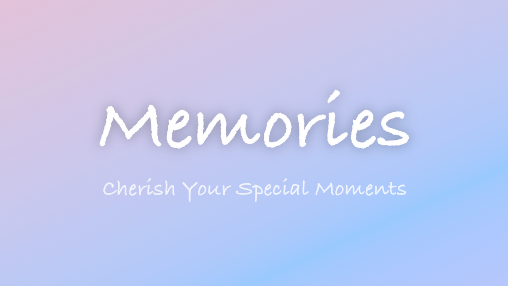

# Memories – Journaling App

- **By**: Shailendra C  
- **Submission for**: Apple Swift Student Challenge 2025

---

## Overview

Memories is a SwiftUI-based journaling app designed for reflection, mood tracking, and mindfulness. Built during my Swift Student Challenge training, this app helps users log emotions, rate their day, and cherish meaningful moments — all through a calming, minimalist UI.

---

## Table of Contents

- [Features](#features)
- [Technologies Used](#technologies-used)
- [Installation](#installation)
- [Usage](#usage)
- [Screenshots](#screenshots)
- [Demo](#demo)
- [Credits](#credits)
- [License](#license)

---

## Features

- **Daily Memory Logging**: Record your thoughts and experiences with a mood-based rating system.
- **Rich Descriptions**: Write a brief "nutshell" and add deeper reflections if needed.
- **Motivational Prompts**: Custom messages based on how your day went.
- **Dark Mode Support**: Seamless visual transitions based on device settings.
- **Export to .txt**: Take your memories elsewhere with one tap.
- **Search & Filter**: Quickly revisit entries using keywords or ratings.
- **Offline-First**: Uses UserDefaults for local memory storage.
- **Beautiful UI**: Pastel colors, clean fonts, and soft animations for a pleasant journaling experience.

---

## Technologies Used

- **Swift**
- **SwiftUI**
- **Xcode 15**
- **Apple Swift Playgrounds**
- **UserDefaults (Local Storage)**

---

## Installation

### Requirements

- Xcode 15 or later
- iOS 16 or later
- Swift Playgrounds (optional if using `.playground` file)

### Steps

1. Clone the repository:
   ```bash
   git clone https://github.com/ctrl-a-shift-del/Memories-A-journaling-app-built-using-swiftUI.git
   ```

2. Open the project in **Xcode**.

3. Build and run the app on your preferred iOS simulator or real device.

---

## Usage

- Tap **“Add Memory”** to rate your day, add a nutshell summary, and optional details.
- Tap **“View Memories”** to scroll through past entries or search/filter them.
- Tap **“Take Your Memories Elsewhere”** to export your journal as a `.txt` file.
- The app adjusts to dark/light mode automatically and gives you encouraging feedback.

---

##Screenshots


---

## Demo

Watch the full walkthrough here:  
[](https://youtu.be/yBgKz5GKpOY)

---

## Credits

Developed by **Shailendra C**  
As part of the **Apple Swift Student Challenge 2025**  
Guided by faculty at **Kumaraguru School of Innovation (KSI)**

---

## License

**No License**  
This project is for **showcasing purposes only**.  
Please do not copy, reuse, or redistribute the code, design, or assets.
